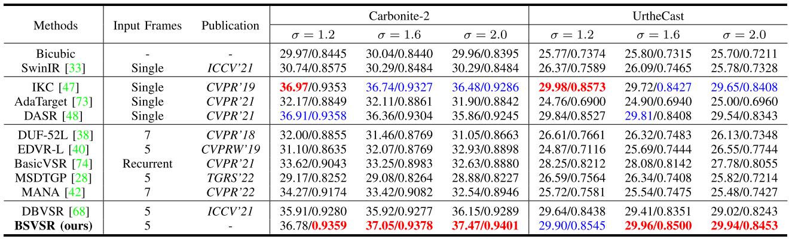

# Blind-Satellite-VSR (IEEE TGRS 2023)
### 📖[**Paper**](https://ieeexplore.ieee.org/document/10172076) | 🖼️[**PDF**](/img/XY-BSVSR.pdf)
PyTorch codes for "[Deep Blind Super-Resolution for Satellite Video](https://ieeexplore.ieee.org/abstract/document/10172076)", **IEEE Transactions on Geoscience and Remote Sensing (TGRS)**, 2023.

Authors: [Yi Xiao](https://xy-boy.github.io/), [Qiangqiang Yuan*](http://qqyuan.users.sgg.whu.edu.cn/), [Qiang Zhang](https://qzhang95.github.io/), and [Liangpei Zhang](http://www.lmars.whu.edu.cn/prof_web/zhangliangpei/rs/index.html)<br>
Wuhan University and Dalian Maritime University 

### Abstract
>Recent efforts have witnessed remarkable progress in satellite video super-resolution (SVSR). However, most SVSR methods usually assume the degradation is fixed and known, e.g., bicubic downsampling, which makes them vulnerable in real-world scenes with multiple and unknown degradations. To alleviate this issue, blind SR has, thus, become a research hotspot. Nevertheless, the existing approaches are mainly engaged in blur kernel estimation while losing sight of another critical aspect for VSR tasks: temporal compensation, especially compensating for blurry and smooth pixels with vital sharpness from severely degraded satellite videos. Therefore, this article proposes a practical blind SVSR algorithm (BSVSR) to explore more sharp cues by considering the pixel-wise blur levels in a coarse-to-fine manner. Specifically, we employed multiscale deformable (MSD) convolution to coarsely aggregate the temporal redundancy into adjacent frames by window-slid progressive fusion. Then, the adjacent features are finely merged into mid-feature using deformable attention (DA), which measures the blur levels of pixels and assigns more weights to the informative pixels, thus inspiring the representation of sharpness. Moreover, we devise a pyramid spatial transformation (PST) module to adjust the solution space of sharp mid-feature, resulting in flexible feature adaptation in multilevel domains. Quantitative and qualitative evaluations on both simulated and real-world satellite videos demonstrate that our BSVSR performs favorably against state-of-the-art nonblind and blind SR models. Code will be available at https://github.com/XY-boy/Blind-Satellite-VSR
>
### 🌱 Overall
 
## 🧩Install
```
git clone https://github.com/XY-boy/Blind-Satellite-VSR.git
```
## Requirements

### 🧩Usage
Coming soon!
## Results
### 🖼️Visual comparison against SOTAs
 
### 🌱Quantitative comparison against SOTAs
 

## Acknowledgement
Our work is built upon DBVSR (https://github.com/cscss/DBVSR) and EDVR (https://github.com/xinntao/EDVR).  
Thanks to the author for sharing these source codes!

## Contact
If you have any questions or suggestions, feel free to contact me. 😊  
Email: xiao_yi@whu.edu.cn; xy574475@gmail.com

## Citation
If you find our work helpful in your research, kindly cite it. Thank you for your interest and support for our work! 😊
```
@ARTICLE{xiao2023bsvsr,
  author={Xiao, Yi and Yuan, Qiangqiang and Zhang, Qiang and Zhang, Liangpei},
  journal={IEEE Transactions on Geoscience and Remote Sensing}, 
  title={Deep Blind Super-Resolution for Satellite Video}, 
  year={2023},
  volume={61},
  number={},
  pages={1-16},
  doi={10.1109/TGRS.2023.3291822}
}
```

